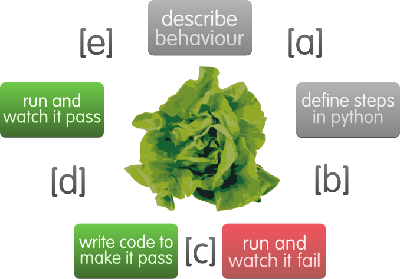

# POC LETTUCE

### Descripción

[Lettuce](http://lettuce.it/tutorial/simple.html#tutorial-simple) es una herramienta que nos permite implementar 
BDD (Behavior Driven Development). Puede ejecutar archivos en formato de texto plano
que contengan pruebas automáticas descritas en forma funcional para proyectos de Python, tal como lo hace Cucumber en Java
o Ruby.

Esto ocasiona que el proceso de desarrollo y pruebas sea realmente fácil, escalable, legible y, lo que es mejor, 
le permite a alguien que no programa describir el comportamiento de un determinado sistema, sin imaginar que esas 
descripciones probarán automáticamente el sistema durante su desarrollo.  
  

### Requerimientos

* python >= 3.6.0
* virtualenv >= 15.1.0 

